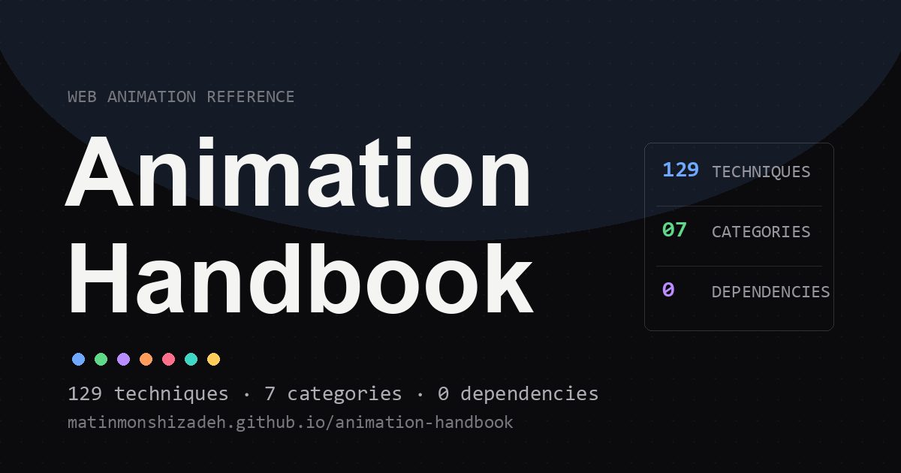

# Animation Handbook

**A visual reference of 129 web animation techniques — every entry is a live, dependency-free demo you can open in the browser and read how it works.**

[**Open the live handbook →**](https://matinmonshizadeh.github.io/animation-handbook/)

     

---

## What this is

Every major web-animation technique in one place, each shown working. Open any folder's `index.html` in a browser and it runs offline — no build step, no frameworks, no CDN. The accompanying `README.md` explains the mechanic, the parameters that matter, and the production gotchas. Built to *inspire* and *teach*, not to sell a library.

## Categories

| # | Category | Count | What's in it |
|:--:|----------|:-----:|--------------|
| 01 | [Scroll-Based](#01) | 26 | Animations driven by scroll position — parallax, sticky, scrub, snap, and narrative storytelling. |
| 02 | [Entrance & Exit](#02) | 13 | Element-level animations for arriving and departing — fades, slides, reveals, flips, and text staggers. |
| 03 | [Page Transitions](#03) | 12 | Full-page transitions between routes or views — crossfades, slides, portals, morphs, and the browser-native API. |
| 04 | [Micro-Interactions](#04) | 29 | Short, user-triggered animations — hover, click, focus, loading states, and UI feedback patterns. |
| 05 | [Text & Typography](#05) | 14 | Animations specifically for type — kinetic motion, character-level effects, gradient flows, and word transformations. |
| 06 | [3D & Advanced](#06) | 18 | WebGL, shaders, particles, 3D transforms, and the performance-sensitive effects that push the browser's limits. |
| 07 | [Ambient & Background](#07) | 17 | Passive, looping effects that hold visual interest without demanding attention — gradients, particles, grain, and glows. |

## Full catalog

All 129 techniques, each linked to its live demo.

### 01 · Scroll-Based · 26 techniques

Animations driven by scroll position — parallax, sticky, scrub, snap, and narrative storytelling.

Browse techniques

- **[Parallax Depth-of-Field](animations/01-scroll-based/parallax-depth-of-field/)** — Five mountain layers translate at different speeds; blur simulates camera depth-of-field.
- **[Parallax Scrolling](animations/01-scroll-based/parallax-scrolling/)** — Elements move at different speeds — background slower, foreground faster — creating a 3D depth illusion.
- **[Reverse-Scrolling Columns](animations/01-scroll-based/reverse-scrolling-columns/)** — A center column scrolls normally while two flanking columns scroll in reverse, looping infinitely.
- **[Cover Card to Fixed Header](animations/01-scroll-based/cover-card-to-fixed-header/)** — A full-page hero morphs into a compact fixed header — every visual property scrubbed to a single progress value.
- **[Fly-in Fly-out Contact List](animations/01-scroll-based/fly-in-fly-out-contact-list/)** — Rows translate and fade through entry, active, and exit zones as you scroll — bidirectional and continuous.
- **[Stacking Cards](animations/01-scroll-based/stacking-cards/)** — CSS Scroll-Driven Animations fan cards into a deck — per-index sticky offset creates the visible peek tab.
- **[ScrollTrigger Animation](animations/01-scroll-based/scroll-trigger/)** — The onEnter / onLeave lifecycle demonstrated with vanilla JS — four scroll trigger zones.
- **[Scrub Animation](animations/01-scroll-based/scrub-animation/)** — Scroll position is the playhead — a flight path doubles as its own timeline, seekable in either direction.
- **[Pin Animation](animations/01-scroll-based/pin-animation/)** — An element freezes in place while the page scrolls beneath it — CSS sticky, no JavaScript pinning.
- **[Snap Scrolling](animations/01-scroll-based/snap-scrolling/)** — CSS scroll-snap-type creates a paginated, magnetic feel — mandatory, proximity, and none compared.
- **[Scrollytelling](animations/01-scroll-based/scrollytelling/)** — Fractional chapter progress drives continuous depth crossfades across six ocean-layer chapters.
- **[Reveal on Scroll](animations/01-scroll-based/reveal-on-scroll/)** — Seven reveal techniques fired by IntersectionObserver at a configurable trigger line.
- **[Stagger Reveal](animations/01-scroll-based/stagger-reveal/)** — Groups reveal with cascading delays — forward, reverse, center-out, and random cascade directions.
- **[Horizontal Scroll](animations/01-scroll-based/horizontal-scroll/)** — Vertical scroll translates a horizontal panel strip — a tall pinned section provides the scroll budget.
- **[Sticky Section](animations/01-scroll-based/sticky-section/)** — The whole section pins while its interior morphs through four states scrubbed to scroll position.
- **[Counter Animation](animations/01-scroll-based/counter-animation/)** — Numbers count 0 → target with easing on scroll entry — four formats and configurable curve.
- **[Progress Bar](animations/01-scroll-based/progress-bar/)** — Reading progress in three styles — top bar, circular ring, and side rail — driven by scrollTop / scrollHeight.
- **[Section Wipe](animations/01-scroll-based/section-wipe/)** — The next section slides over the current via sticky z-index stacking — scale-down adds depth.
- **[Zoom Into Image](animations/01-scroll-based/zoom-into-image/)** — clip-path expands from a framed card to full-bleed as you scroll — the portal effect.
- **[Scroll Image Sequence](animations/01-scroll-based/scroll-image-sequence/)** — A canvas pinned with sticky; scroll progress maps to a frame index — the Apple product-scroll technique, frames drawn procedurally.
- **[Smooth (Inertia) Scroll](animations/01-scroll-based/smooth-scroll/)** — Wheel and touch input eased toward a target each frame — weighted, gliding momentum instead of native jumps.
- **[Text Fill on Scroll](animations/01-scroll-based/text-fill-on-scroll/)** — A pinned paragraph fills word by word as you scroll — pause mid-read, scroll back and it un-reads.
- **[Scroll Velocity Skew](animations/01-scroll-based/scroll-velocity-skew/)** — Content shears with scroll speed and springs straight when you stop — motion mapped to velocity, not position.
- **[SVG Line Draw on Scroll](animations/01-scroll-based/svg-line-draw/)** — A winding route draws itself down the page via stroke-dashoffset, passing waypoints as you travel.
- **[Scrollspy Navigation](animations/01-scroll-based/scrollspy-nav/)** — A nav rail tracks the section in view with a sliding indicator — the docs-site pattern.
- **[Scroll-Driven Background Color](animations/01-scroll-based/scroll-background-color/)** — The background blends between section palettes as you scroll, flipping text contrast on light stops.

### 02 · Entrance & Exit · 13 techniques

Element-level animations for arriving and departing — fades, slides, reveals, flips, and text staggers.

Browse techniques

- **[Fade In / Fade Out](animations/02-entrance-and-exit/fade-in-out/)** — Opacity 0 → 1 enter, 1 → 0 exit — the compositor handles this without re-painting.
- **[Slide In](animations/02-entrance-and-exit/slide-in/)** — Translates from an off-screen edge into final position — with or without simultaneous fade.
- **[Slide Up Reveal](animations/02-entrance-and-exit/slide-up-reveal/)** — Text rises from below its clip boundary — translateY method vs clip-path inset, identical visual result.
- **[Scale In / Zoom In](animations/02-entrance-and-exit/scale-in/)** — Scales from a small start value to 1.0 — transform-origin controls where the pop expands from.
- **[Clip-Path Reveal](animations/02-entrance-and-exit/clip-path-reveal/)** — A shape mask expands to uncover the element — content is always rendered, just progressively visible.
- **[Curtain Reveal](animations/02-entrance-and-exit/curtain-reveal/)** — A colored bar slides over content then off the other side — the reveal is hidden then exposed.
- **[Split Text Reveal](animations/02-entrance-and-exit/split-text-reveal/)** — Text split into chars, words, or lines — each piece staggers with --index CSS transition-delay.
- **[Letter-by-Letter Stagger](animations/02-entrance-and-exit/letter-by-letter-stagger/)** — CSS transition-delay cascade per letter, or JS typewriter mode with a blinking cursor.
- **[Word-by-Word Reveal](animations/02-entrance-and-exit/word-by-word-reveal/)** — Words animate sequentially at 80–120ms per word — the readable stagger speed for taglines.
- **[Blur In](animations/02-entrance-and-exit/blur-in/)** — Fades in while reducing blur — mimics camera focus pulling. Best on single hero elements.
- **[Flip In](animations/02-entrance-and-exit/flip-in/)** — Rotates from a flat plane into view using CSS 3D perspective — perspective on the parent is the key.
- **[Bounce In](animations/02-entrance-and-exit/bounce-in/)** — Overshoots final position then springs back — explicit @keyframes waypoints, not easing alone.
- **[Rotate In](animations/02-entrance-and-exit/rotate-in/)** — Spins while entering — best on radially-symmetric shapes like icons, stars, and gears.

### 03 · Page Transitions · 12 techniques

Full-page transitions between routes or views — crossfades, slides, portals, morphs, and the browser-native API.

Browse techniques

- **[View Transitions API](animations/03-page-transitions/view-transitions-api/)** — document.startViewTransition() — the browser captures before/after and animates automatically.
- **[Shared Element Transition](animations/03-page-transitions/shared-element-transition/)** — A thumbnail morphs continuously into a detail hero as pages change — the FLIP technique applied.
- **[Morph Transition](animations/03-page-transitions/morph-transition/)** — An SVG path morphs between page-specific shapes — point-by-point interpolation across 12-vertex paths.
- **[Crossfade](animations/03-page-transitions/crossfade/)** — Both pages visible simultaneously at ~50% opacity mid-transition — compare with sequential fade.
- **[Slide Transition](animations/03-page-transitions/slide-transition/)** — Directional slides with forward/back awareness — matches native iOS and Android navigation patterns.
- **[Zoom Transition](animations/03-page-transitions/zoom-transition/)** — Three scale variants — zoom-in, zoom-out, pull-through — each implying different spatial depth.
- **[Flash / Light Leak](animations/03-page-transitions/flash-transition/)** — A colored flash peaks at full opacity, hides the page swap, then fades to reveal the new scene.
- **[Blur Transition](animations/03-page-transitions/blur-transition/)** — Current page blurs and fades out, then new page sharpens in — a defocus wipe between scenes.
- **[Elastic Transition](animations/03-page-transitions/elastic-transition/)** — Spring physics cause overshoot before settling — CSS keyframes or live JS spring simulation.
- **[Portal / Tunnel Zoom](animations/03-page-transitions/portal-zoom/)** — clip-path expands from a portal element's center, zooming the viewport into the next page.
- **[Dissolve](animations/03-page-transitions/dissolve/)** — Random tiles fade at staggered delays — a non-uniform wipe that reads as dissolving rather than fading.
- **[FLIP Technique](animations/03-page-transitions/flip-technique/)** — First-Last-Invert-Play — CSS layout changes animated seamlessly by measuring position deltas.

### 04 · Micro-Interactions · 29 techniques

Short, user-triggered animations — hover, click, focus, loading states, and UI feedback patterns.

Browse techniques

- **[Hover State Animation](animations/04-micro-interactions/hover-state/)** — Six hover techniques side by side — color shift, scale, lift, underline grow, icon nudge, and background sweep.
- **[Click / Tap Ripple](animations/04-micro-interactions/click-ripple/)** — Ripple emanates from the exact click point — Material Design's tactile confirmation pattern.
- **[Focus Ring Animation](animations/04-micro-interactions/focus-ring/)** — Animated outline on keyboard Tab — :focus-visible ensures mouse users see no ring.
- **[Button Press Scale](animations/04-micro-interactions/button-press-scale/)** — Scales to 0.95 on press, springs back on release — asymmetric timing gives a tactile feel.
- **[Magnetic Button](animations/04-micro-interactions/magnetic-button/)** — Button leans toward the cursor within a radius, label lagging for parallax — springs home on exit.
- **[Toggle / Switch Slide](animations/04-micro-interactions/toggle-switch/)** — Pill slides left/right for on/off — smooth cubic-bezier gives a weighted, physical feel.
- **[Heart / Like Burst](animations/04-micro-interactions/heart-burst/)** — Tap pops and fills the heart while small hearts burst outward on canvas — Twitter-style like.
- **[Success Confetti](animations/04-micro-interactions/success-confetti/)** — Completing an action fires a canvas confetti burst — rotating rectangles with gravity and spin.
- **[Skeleton Loader](animations/04-micro-interactions/skeleton-loader/)** — Pulsing placeholder blocks match the shape of real content — reduces perceived wait time.
- **[Shimmer Effect](animations/04-micro-interactions/shimmer-effect/)** — Gradient sweep over skeleton placeholders — gives the impression of data streaming in.
- **[Loading Spinner](animations/04-micro-interactions/loading-spinner/)** — Six spinner variants from a single CSS color and speed — ring, orbit, arc, bounce, pulse, square.
- **[Progress Animation](animations/04-micro-interactions/progress-animation/)** — Linear bar, circular ring, and stepped segments — all driven by a single percentage value.
- **[Checkmark Draw](animations/04-micro-interactions/checkmark-draw/)** — SVG path draws progressively on success — stroke-dashoffset animates from full length to zero.
- **[Form Field Morph](animations/04-micro-interactions/form-field-morph/)** — Floating label rises out of the input on focus — persists when the field is filled.
- **[Notification Badge Pulse](animations/04-micro-interactions/badge-pulse/)** — Dot on icon pulses to draw peripheral attention — scale, halo, or both.
- **[Tooltip Reveal](animations/04-micro-interactions/tooltip-reveal/)** — Info box fades in after a 300ms delay — long enough to avoid triggering on mouse pass-through.
- **[Drawer / Panel Slide](animations/04-micro-interactions/drawer-slide/)** — Off-canvas panel slides from edge — ease-out open, ease-in close. Backdrop dismisses.
- **[Modal Expand](animations/04-micro-interactions/modal-expand/)** — Modal scales from the trigger button's position — transform-origin set to where you clicked.
- **[Accordion Open/Close](animations/04-micro-interactions/accordion/)** — Height animates between 0 and auto — JS measured height vs CSS grid-template-rows compared.
- **[Cursor Follower](animations/04-micro-interactions/cursor-follower/)** — Custom element follows mouse with lerp lag — mix-blend-mode: difference inverts any background.
- **[Error Shake](animations/04-micro-interactions/error-shake/)** — An invalid field shakes horizontally with a decaying wobble and flashes red — the universal "no".
- **[Swipe to Dismiss](animations/04-micro-interactions/swipe-to-dismiss/)** — Drag a card past a threshold and it flies off as the row collapses — pointer-driven, touch-ready.
- **[Hamburger Menu Toggle](animations/04-micro-interactions/hamburger-menu-toggle/)** — The bars icon morphs to an X — top and bottom bars rotate to cross while the middle fades out.
- **[Theme Toggle Morph](animations/04-micro-interactions/theme-toggle-morph/)** — A sun morphs into a crescent moon as the interface flips between light and dark.
- **[Copy to Clipboard](animations/04-micro-interactions/copy-to-clipboard/)** — The copy button swaps to a checkmark and a Copied confirmation, then reverts after a moment.
- **[Star Rating](animations/04-micro-interactions/star-rating/)** — Stars fill toward the pointer and pop on commit — an accessible five-star control.
- **[Toast Notification](animations/04-micro-interactions/toast-notification/)** — Notification cards slide in from a corner, stack, and auto-dismiss with a progress bar — swipe or click to dismiss.
- **[Segmented Control](animations/04-micro-interactions/segmented-control/)** — A highlighted pill slides beneath the selected segment as the active label crossfades — the iOS control.
- **[Pull to Refresh](animations/04-micro-interactions/pull-to-refresh/)** — Dragging past the top reveals a spinner that fills with distance; release past the threshold to refresh.

### 05 · Text & Typography · 14 techniques

Animations specifically for type — kinetic motion, character-level effects, gradient flows, and word transformations.

Browse techniques

- **[Kinetic Typography](animations/05-text-typography/kinetic-typography/)** — Phrases enter, transform, and exit in a choreographed timeline — motion reinforces meaning.
- **[Typewriter Effect](animations/05-text-typography/typewriter-effect/)** — Characters appear one at a time with a blinking cursor — natural timing variance makes it feel human.
- **[Scramble / Glitch Text](animations/05-text-typography/scramble-text/)** — Characters cycle randomly before locking left-to-right — decryption and sci-fi aesthetic.
- **[Variable Font Morph](animations/05-text-typography/variable-font-morph/)** — CSS font-variation-settings animates weight, slant, and casual axes of a variable font.
- **[Text Clip-Path Reveal](animations/05-text-typography/text-clip-path-reveal/)** — Lines reveal via expanding clip-path mask — preserves kerning and typographic spacing exactly.
- **[Marquee / Ticker](animations/05-text-typography/marquee-ticker/)** — Continuous horizontal scroll with seamless loop — duplicated content makes the reset invisible.
- **[Text Morphing](animations/05-text-typography/text-morphing/)** — One word transitions into another character by character — each letter slides out as the next slides in.
- **[Text Gradient Animation](animations/05-text-typography/text-gradient-animation/)** — background-clip: text with animated background-position flows color through the characters.
- **[Outline to Fill](animations/05-text-typography/outline-to-fill/)** — Hollow stroke letterforms fill with color — clip-path reveal or opacity crossfade.
- **[Enter/Exit Typography](animations/05-text-typography/enter-exit-typography/)** — Three-act phrase lifecycle: enter → hold → exit, sequenced for storytelling.
- **[Rotate Word Carousel](animations/05-text-typography/rotate-word-carousel/)** — One keyword cycles through a list while the surrounding sentence stays static.
- **[Glitch Text](animations/05-text-typography/glitch-text/)** — RGB-split copies jitter behind animated clip-path slices — the datamosh / signal-loss aesthetic.
- **[Text on a Path](animations/05-text-typography/text-on-path/)** — Text flows along an SVG curve via textPath with an animated startOffset — wave, arc, or circle.
- **[Wavy Text](animations/05-text-typography/wavy-text/)** — Per-letter sine-wave bob with a staggered delay sends a wave travelling across the word.

### 06 · 3D & Advanced · 18 techniques

WebGL, shaders, particles, 3D transforms, and the performance-sensitive effects that push the browser's limits.

Browse techniques

- **[3D Model Orbit](animations/06-3d-advanced/3d-model-orbit/)** — Phong-shaded WebGL geometry — vertex buffers, MVP matrix, and lighting in raw WebGL.
- **[Scroll-Driven 3D Rotation](animations/06-3d-advanced/scroll-driven-3d-rotation/)** — CSS cube rotates through four choreographed stages as you scroll — the Apple product-page pattern.
- **[Parallax 3D Tilt](animations/06-3d-advanced/parallax-3d-tilt/)** — CSS perspective + rotateX/Y follows mouse — a shine highlight tracks the virtual light source.
- **[Canvas Particle Effect](animations/06-3d-advanced/canvas-particle-effect/)** — 500 drifting particles with O(n²) proximity connections and mouse repel/attract on 2D canvas.
- **[Fluid Simulation](animations/06-3d-advanced/fluid-simulation/)** — WebGL metaballs — SDF spheres merged via smooth-minimum in a GLSL fragment shader.
- **[Glassmorphism Animated](animations/06-3d-advanced/glassmorphism-animated/)** — backdrop-filter: blur() over animated gradient blobs — three frost variants.
- **[WebGL Shader Animation](animations/06-3d-advanced/webgl-shader-animation/)** — Four GLSL fragment shader presets: plasma, wave distortion, Voronoi, kaleidoscope.
- **[Noise-Based Motion](animations/06-3d-advanced/noise-based-motion/)** — Simplex noise drives a wind field and a morphing blob — smooth random, not chaotic random.
- **[SVG Path Animation](animations/06-3d-advanced/svg-path-animation/)** — stroke-dashoffset reveals three SVG drawings — icon, signature, and logo mark.
- **[Chromatic Aberration](animations/06-3d-advanced/chromatic-aberration/)** — RGB channels offset via mix-blend-mode: screen — static, pulse, and glitch modes.
- **[2.5D / Pseudo-3D](animations/06-3d-advanced/2-5d-pseudo-3d/)** — Seven depth layers parallax at different rates — mouse-driven or auto-panning camera.
- **[Ray Marching / SDF](animations/06-3d-advanced/ray-marching-sdf/)** — 3D scene entirely in a fragment shader — sphere blend, boolean ops, infinite repetition.
- **[GPGPU Particle System](animations/06-3d-advanced/gpgpu-particle-system/)** — 65k+ particles computed in WebGL2 textures — physics in a shader, texture ping-pong.
- **[Image Distortion on Hover](animations/06-3d-advanced/image-distortion-hover/)** — Fragment shader displaces UV coordinates around the cursor — ripple, push, liquid, pixelate.
- **[Cloth Simulation](animations/06-3d-advanced/cloth-simulation/)** — Verlet integration + distance constraints — draggable flag responds to gravity and wind.
- **[Volumetric Smoke](animations/06-3d-advanced/volumetric-smoke/)** — Ray marching accumulates 3D noise density — light scattering, shadow rays, fBm clouds.
- **[Morphing Blob](animations/06-3d-advanced/morphing-blob/)** — Metaball circles fused by an SVG blur-plus-contrast filter melt like liquid — the blob drifts and a droplet chases the pointer.
- **[3D Flip Card](animations/06-3d-advanced/flip-card-3d/)** — A card rotates in 3D to reveal its back face using preserve-3d, perspective, and backface-visibility.

### 07 · Ambient & Background · 17 techniques

Passive, looping effects that hold visual interest without demanding attention — gradients, particles, grain, and glows.

Browse techniques

- **[Animated Gradient Background](animations/07-ambient-background/animated-gradient-background/)** — CSS gradient shifts hue and position continuously — pure CSS, no JavaScript, seamless loop.
- **[Mesh Gradient Animation](animations/07-ambient-background/mesh-gradient/)** — Blurred radial gradient blobs drift slowly — organic color washes popularized by Stripe.
- **[Aurora / Northern Lights](animations/07-ambient-background/aurora/)** — Tall color bands drift and skew horizontally — heavy blur fakes the curtain of light.
- **[Grain / Film Noise Overlay](animations/07-ambient-background/grain-overlay/)** — Animated noise at 5–10% opacity adds cinematic warmth — subtlety is everything.
- **[Scanline Effect](animations/07-ambient-background/scanline/)** — CRT horizontal lines with optional sweep beam, curvature, and phosphor glow.
- **[Light Leak](animations/07-ambient-background/light-leak/)** — Warm gradient fires at random irregular intervals — analog film camera aesthetic.
- **[Starfield / Space Particles](animations/07-ambient-background/starfield/)** — Stars drift outward from center with parallax depth — slow ambient speed, never hyperspace.
- **[Breathing / Pulsing Glow](animations/07-ambient-background/breathing-glow/)** — Radial glow expands and contracts on a 5-second breath cycle — calm resting state.
- **[Ambient Ripple Effect](animations/07-ambient-background/ambient-ripple/)** — Concentric rings emit periodically from idle sources — passive atmosphere, not click-driven.
- **[Floating Elements](animations/07-ambient-background/floating-elements/)** — Geometric shapes drift on independent sine-wave paths — no two elements synchronized.
- **[Grid / Dot Pattern Parallax](animations/07-ambient-background/grid-dot-pattern-parallax/)** — Pattern shifts subtly opposite to mouse movement — depth felt, barely seen.
- **[Abstract Geometric Motion](animations/07-ambient-background/abstract-geometric-motion/)** — Four hypnotic loops: rotating polygons, expanding rings, sliding bars, flowing color lines.
- **[Particle Constellation](animations/07-ambient-background/particle-constellation/)** — Drifting nodes link with lines when they come close — the network-mesh hero background.
- **[Flow Field](animations/07-ambient-background/flow-field/)** — Particles follow a noise-driven vector field, leaving flowing trails.
- **[Synthwave Grid](animations/07-ambient-background/synthwave-grid/)** — A perspective grid scrolls toward a glowing sun — the retro synthwave horizon.
- **[Matrix Rain](animations/07-ambient-background/matrix-rain/)** — Columns of glowing characters fall down a dark canvas, leaders bright and trails fading.
- **[Plasma Field](animations/07-ambient-background/plasma/)** — Summed sine functions of x, y, and time make a flowing, organic color field — the demoscene classic.

## Design principles

**One technique, one file.** No build step, no frameworks, no external dependencies. Open the HTML and it runs.

**Show, then explain.** The demo is the main artifact. The README supports it.

**Technique over tool.** GSAP, Framer Motion, and Three.js are mentioned in production notes — they are never the subject of an entry.

## Contributing

Contributions are welcome — new techniques, fixes, and improvements. Each animation lives under `animations/<category>/<slug>/` with exactly `index.html` and `README.md`. See [CONTRIBUTING.md](CONTRIBUTING.md) for the authoring guide and [CLAUDE.md](CLAUDE.md) for the full spec.

If this handbook helped you, a ⭐ makes it easier for others to find.

## License

[MIT](LICENSE) © matinmonshizadeh
