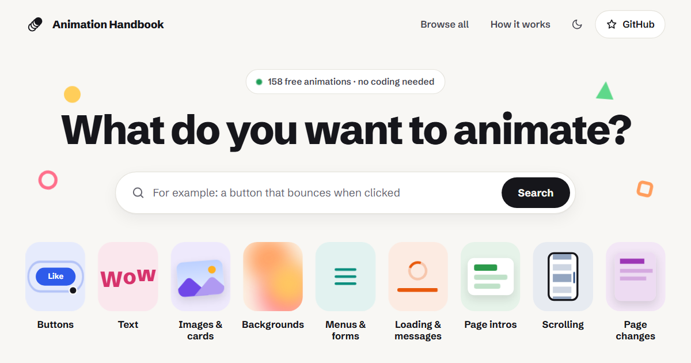

# Animation Handbook

**A visual reference of 129 web animation techniques — every entry is a live, dependency-free demo you can open in the browser and read how it works.**

[**Open the live handbook →**](https://matinmonshizadeh.github.io/animation-handbook/)

     

---

## What this is

Every major web-animation technique in one place, each shown working. Open any folder's `index.html` in a browser and it runs offline — no build step, no frameworks, no CDN. The accompanying `README.md` explains the mechanic, the parameters that matter, and the production gotchas. Built to *inspire* and *teach*, not to sell a library.

## Categories

| # | Category | Count | What's in it |
|:--:|----------|:-----:|--------------|
| 01 | [Scroll-Based](#01) | 26 | Animations driven by scroll position — parallax, sticky, scrub, snap, and narrative storytelling. |
| 02 | [Entrance & Exit](#02) | 13 | Element-level animations for arriving and departing — fades, slides, reveals, flips, and text staggers. |
| 03 | [Page Transitions](#03) | 12 | Full-page transitions between routes or views — crossfades, slides, portals, morphs, and the browser-native API. |
| 04 | [Micro-Interactions](#04) | 29 | Short, user-triggered animations — hover, click, focus, loading states, and UI feedback patterns. |
| 05 | [Text & Typography](#05) | 14 | Animations specifically for type — kinetic motion, character-level effects, gradient flows, and word transformations. |
| 06 | [3D & Advanced](#06) | 18 | WebGL, shaders, particles, 3D transforms, and the performance-sensitive effects that push the browser's limits. |
| 07 | [Ambient & Background](#07) | 17 | Passive, looping effects that hold visual interest without demanding attention — gradients, particles, grain, and glows. |

## Full catalog

All 129 techniques, each linked to its live demo.

### 01 · Scroll-Based · 26 techniques

Animations driven by scroll position — parallax, sticky, scrub, snap, and narrative storytelling.

Browse techniques

- **[Parallax Depth-of-Field](animations/01-scroll-based/parallax-depth-of-field/)** — Layers move at their own speed as the focus shifts. Best for cinematic intros.
- **[Parallax Scrolling](animations/01-scroll-based/parallax-scrolling/)** — Far layers move slower than near ones as you scroll. Best for hero scenes.
- **[Reverse-Scrolling Columns](animations/01-scroll-based/reverse-scrolling-columns/)** — Side columns run the opposite way to the middle one. Best for portfolios.
- **[Cover Card to Fixed Header](animations/01-scroll-based/cover-card-to-fixed-header/)** — A tall cover shrinks into a slim header as you scroll. Best for articles.
- **[Fly-in Fly-out Contact List](animations/01-scroll-based/fly-in-fly-out-contact-list/)** — Rows fade and slide as they near the top or bottom edge. Best for long lists.
- **[Stacking Cards](animations/01-scroll-based/stacking-cards/)** — Cards stick at the top and pile into a deck. Best for step-by-step stories.
- **[ScrollTrigger Animation](animations/01-scroll-based/scroll-trigger/)** — Animations start, follow and pin at set scroll points. Best for landing pages.
- **[Scrub Animation](animations/01-scroll-based/scrub-animation/)** — Scroll plays it forward and back, like dragging a video. Best for product tours.
- **[Pin Animation](animations/01-scroll-based/pin-animation/)** — One part stays put while its text changes on scroll. Best for feature lists.
- **[Snap Scrolling](animations/01-scroll-based/snap-scrolling/)** — The box settles on one whole section at a time. Best for slides and galleries.
- **[Scrollytelling](animations/01-scroll-based/scrollytelling/)** — A picture beside the story changes as you read down. Best for data stories.
- **[Reveal on Scroll](animations/01-scroll-based/reveal-on-scroll/)** — Cards appear as they cross a line in the box. Best for long landing pages.
- **[Stagger Reveal](animations/01-scroll-based/stagger-reveal/)** — Items in a group appear one after another as it scrolls in. Best for card grids.
- **[Horizontal Scroll](animations/01-scroll-based/horizontal-scroll/)** — Scroll down and a row of panels slides sideways. Best for portfolios.
- **[Sticky Section](animations/01-scroll-based/sticky-section/)** — A section holds still while its content changes. Best for feature tours.
- **[Counter Animation](animations/01-scroll-based/counter-animation/)** — Numbers count up when they scroll into view. Best for stats.
- **[Progress Bar](animations/01-scroll-based/progress-bar/)** — A bar fills as you read down the page. Best for long articles.
- **[Section Wipe](animations/01-scroll-based/section-wipe/)** — Each section slides up over the one before. Best for full-screen stories.
- **[Zoom Into Image](animations/01-scroll-based/zoom-into-image/)** — A small window opens up to fill the box as you scroll. Best for hero images.
- **[Scroll Image Sequence](animations/01-scroll-based/scroll-image-sequence/)** — Scrolling plays a series of pictures like a flip-book. Best for products.
- **[Smooth (Inertia) Scroll](animations/01-scroll-based/smooth-scroll/)** — Scrolling glides to a stop instead of jumping. Best for portfolio sites.
- **[Text Fill on Scroll](animations/01-scroll-based/text-fill-on-scroll/)** — Words light up one by one as you scroll. Best for key statements.
- **[Scroll Velocity Skew](animations/01-scroll-based/scroll-velocity-skew/)** — Rows lean when you scroll fast and straighten when you stop. Best for galleries.
- **[SVG Line Draw on Scroll](animations/01-scroll-based/svg-line-draw/)** — A line draws itself along a route as you scroll. Best for timelines.
- **[Scrollspy Navigation](animations/01-scroll-based/scrollspy-nav/)** — A menu highlights the section you are reading. Best for long docs.
- **[Scroll-Driven Background Color](animations/01-scroll-based/scroll-background-color/)** — The background color changes as you scroll through sections. Best for stories.

### 02 · Entrance & Exit · 13 techniques

Element-level animations for arriving and departing — fades, slides, reveals, flips, and text staggers.

Browse techniques

- **[Fade In / Fade Out](animations/02-entrance-and-exit/fade-in-out/)** — Fades in to appear and fades out to leave. Best for pop-ups and tooltips.
- **[Slide In](animations/02-entrance-and-exit/slide-in/)** — Travels into place from one edge. Best for side panels and notifications.
- **[Slide Up Reveal](animations/02-entrance-and-exit/slide-up-reveal/)** — Text rises into view from behind an invisible edge. Best for headlines.
- **[Scale In / Zoom In](animations/02-entrance-and-exit/scale-in/)** — Grows from smaller to full size. Best for pop-ups and menus.
- **[Clip-Path Reveal](animations/02-entrance-and-exit/clip-path-reveal/)** — A growing shape uncovers it while it stays still. Best for images and banners.
- **[Curtain Reveal](animations/02-entrance-and-exit/curtain-reveal/)** — A colored panel covers it, then slides away. Best for intros and logos.
- **[Split Text Reveal](animations/02-entrance-and-exit/split-text-reveal/)** — Text breaks into pieces that appear one after another. Best for headlines.
- **[Letter-by-Letter Stagger](animations/02-entrance-and-exit/letter-by-letter-stagger/)** — A phrase appears letter by letter or typewriter-style. Best for short headlines.
- **[Word-by-Word Reveal](animations/02-entrance-and-exit/word-by-word-reveal/)** — Words appear one after another at a reading pace. Best for quotes and intros.
- **[Blur In](animations/02-entrance-and-exit/blur-in/)** — Comes into focus from a blur, like a camera. Best for featured cards and photos.
- **[Flip In](animations/02-entrance-and-exit/flip-in/)** — Swings into view in 3D, like a card turning over. Best for cards and tiles.
- **[Bounce In](animations/02-entrance-and-exit/bounce-in/)** — Lands with a springy bounce. Best for badges and success messages.
- **[Rotate In](animations/02-entrance-and-exit/rotate-in/)** — Spins into place while it grows. Best for icons, stars and badges.

### 03 · Page Transitions · 12 techniques

Full-page transitions between routes or views — crossfades, slides, portals, morphs, and the browser-native API.

Browse techniques

- **[View Transitions API](animations/03-page-transitions/view-transitions-api/)** — The browser animates the change between two pages for you. Best for web apps.
- **[Shared Element Transition](animations/03-page-transitions/shared-element-transition/)** — A picture grows from the list into the next page's header. Best for galleries.
- **[Morph Transition](animations/03-page-transitions/morph-transition/)** — The logo changes shape to match each page you visit. Best for brand marks.
- **[Crossfade](animations/03-page-transitions/crossfade/)** — The old page fades out as the new one fades in. Best for calm page changes.
- **[Slide Transition](animations/03-page-transitions/slide-transition/)** — Pages slide across, and going back slides the other way. Best for step flows.
- **[Zoom Transition](animations/03-page-transitions/zoom-transition/)** — The pages zoom as they swap, as if moving in depth. Best for opening details.
- **[Flash / Light Leak](animations/03-page-transitions/flash-transition/)** — A burst of light hides the moment the page changes. Best for bold, lively sites.
- **[Blur Transition](animations/03-page-transitions/blur-transition/)** — The old page blurs away and the new one comes into focus. Best for photo sites.
- **[Elastic Transition](animations/03-page-transitions/elastic-transition/)** — The new page slides in, goes too far and springs back. Best for playful apps.
- **[Portal / Tunnel Zoom](animations/03-page-transitions/portal-zoom/)** — The next page opens out of a circle you click. Best for big reveals.
- **[Dissolve](animations/03-page-transitions/dissolve/)** — The page breaks into tiles that give way to the next. Best for photo galleries.
- **[FLIP Technique](animations/03-page-transitions/flip-technique/)** — Cards glide to their new places when the layout changes. Best for sorting lists.

### 04 · Micro-Interactions · 29 techniques

Short, user-triggered animations — hover, click, focus, loading states, and UI feedback patterns.

Browse techniques

- **[Hover State Animation](animations/04-micro-interactions/hover-state/)** — Six ways a card can react when you point at it. Best for buttons and cards.
- **[Click / Tap Ripple](animations/04-micro-interactions/click-ripple/)** — A ripple spreads out from the spot you press. Best for buttons and list items.
- **[Focus Ring Animation](animations/04-micro-interactions/focus-ring/)** — A ring closes in around the item the Tab key reaches. Best for forms and menus.
- **[Button Press Scale](animations/04-micro-interactions/button-press-scale/)** — Shrinks as you press it and springs back as you let go. Best for main buttons.
- **[Magnetic Button](animations/04-micro-interactions/magnetic-button/)** — Leans toward the pointer, then springs home. Best for one main button.
- **[Toggle / Switch Slide](animations/04-micro-interactions/toggle-switch/)** — The knob slides across as the switch turns on or off. Best for settings.
- **[Heart / Like Burst](animations/04-micro-interactions/heart-burst/)** — The heart pops and fills as small hearts burst out. Best for like buttons.
- **[Success Confetti](animations/04-micro-interactions/success-confetti/)** — Confetti bursts from the button when a task is done. Best for big moments.
- **[Skeleton Loader](animations/04-micro-interactions/skeleton-loader/)** — Gray shapes hold the place of content while it loads. Best for feeds and cards.
- **[Shimmer Effect](animations/04-micro-interactions/shimmer-effect/)** — A band of light sweeps over gray placeholders. Best for loading screens.
- **[Loading Spinner](animations/04-micro-interactions/loading-spinner/)** — Six small shapes loop to show that something is loading. Best for short waits.
- **[Progress Animation](animations/04-micro-interactions/progress-animation/)** — A bar, a ring and steps fill up to show progress. Best for uploads.
- **[Checkmark Draw](animations/04-micro-interactions/checkmark-draw/)** — A tick draws itself in a circle once a task succeeds. Best for forms.
- **[Form Field Morph](animations/04-micro-interactions/form-field-morph/)** — The label moves up out of the way as you type. Best for sign-up forms.
- **[Notification Badge Pulse](animations/04-micro-interactions/badge-pulse/)** — A badge on an icon pulses to catch the eye. Best for unread messages.
- **[Tooltip Reveal](animations/04-micro-interactions/tooltip-reveal/)** — A small label fades in after a short pause. Best for icon buttons.
- **[Drawer / Panel Slide](animations/04-micro-interactions/drawer-slide/)** — A side panel slides in over a dimmed page. Best for mobile menus.
- **[Modal Expand](animations/04-micro-interactions/modal-expand/)** — A window grows out of the button you pressed. Best for detail views.
- **[Accordion Open/Close](animations/04-micro-interactions/accordion/)** — Each question opens smoothly to show its answer. Best for FAQ pages.
- **[Cursor Follower](animations/04-micro-interactions/cursor-follower/)** — A dot trails your pointer and flips the colors under it. Best for portfolios.
- **[Error Shake](animations/04-micro-interactions/error-shake/)** — A field shakes side to side when the input is wrong. Best for sign-in forms.
- **[Swipe to Dismiss](animations/04-micro-interactions/swipe-to-dismiss/)** — A card dragged sideways flies off and the list closes up. Best for inboxes.
- **[Hamburger Menu Toggle](animations/04-micro-interactions/hamburger-menu-toggle/)** — Three lines turn into an X as the menu opens. Best for mobile menus.
- **[Theme Toggle Morph](animations/04-micro-interactions/theme-toggle-morph/)** — A sun turns into a moon as the colors switch to dark. Best for theme buttons.
- **[Copy to Clipboard](animations/04-micro-interactions/copy-to-clipboard/)** — Copy turns into a tick and Copied, then changes back. Best for codes and links.
- **[Star Rating](animations/04-micro-interactions/star-rating/)** — Stars fill up to your pointer and pop when you choose. Best for reviews.
- **[Toast Notification](animations/04-micro-interactions/toast-notification/)** — Short messages slide into a corner, then leave on their own. Best for updates.
- **[Segmented Control](animations/04-micro-interactions/segmented-control/)** — A highlight slides to the option you pick. Best for switching views.
- **[Pull to Refresh](animations/04-micro-interactions/pull-to-refresh/)** — Pulling a list down shows a spinner, then new items. Best for feeds.
- **[Animated Gradient Border](animations/04-micro-interactions/gradient-border/)** — A band of colors runs around the edge of a card or button. Best for featured offers.

### 05 · Text & Typography · 14 techniques

Animations specifically for type — kinetic motion, character-level effects, gradient flows, and word transformations.

Browse techniques

- **[Kinetic Typography](animations/05-text-typography/kinetic-typography/)** — Words arrive and leave one by one, each moving its own way. Best for intros.
- **[Typewriter Effect](animations/05-text-typography/typewriter-effect/)** — Text types itself out behind a blinking cursor. Best for short taglines.
- **[Scramble / Glitch Text](animations/05-text-typography/scramble-text/)** — Random symbols lock into the real text, left to right. Best for tech headlines.
- **[Variable Font Morph](animations/05-text-typography/variable-font-morph/)** — A word smoothly turns bold, then light, and leans over. Best for headlines.
- **[Text Clip-Path Reveal](animations/05-text-typography/text-clip-path-reveal/)** — Each line of a headline is uncovered in turn. Best for big headlines.
- **[Marquee / Ticker](animations/05-text-typography/marquee-ticker/)** — Text scrolls sideways in an endless loop, with no seam. Best for news tickers.
- **[Text Morphing](animations/05-text-typography/text-morphing/)** — One word changes into the next, letter by letter. Best for short labels.
- **[Text Gradient Animation](animations/05-text-typography/text-gradient-animation/)** — Colors flow through the letters while the text stays still. Best for headlines.
- **[Outline to Fill](animations/05-text-typography/outline-to-fill/)** — Hollow letters fill with color, as a wipe or a fade. Best for big headlines.
- **[Enter/Exit Typography](animations/05-text-typography/enter-exit-typography/)** — Each phrase comes in, stays long enough to read, then leaves. Best for slogans.
- **[Rotate Word Carousel](animations/05-text-typography/rotate-word-carousel/)** — One word in a sentence keeps swapping for the next. Best for hero headlines.
- **[Glitch Text](animations/05-text-typography/glitch-text/)** — Text tears into red and cyan strips like a broken signal. Best for bold titles.
- **[Text on a Path](animations/05-text-typography/text-on-path/)** — Text travels along a wave, an arc or a circle. Best for badges and seals.
- **[Wavy Text](animations/05-text-typography/wavy-text/)** — A wave rolls through the word, letter by letter. Best for playful titles.

### 06 · 3D & Advanced · 18 techniques

WebGL, shaders, particles, 3D transforms, and the performance-sensitive effects that push the browser's limits.

Browse techniques

- **[3D Model Orbit](animations/06-3d-advanced/3d-model-orbit/)** — A lit 3D shape spins, or turns to face your pointer. Best for product views.
- **[Scroll-Driven 3D Rotation](animations/06-3d-advanced/scroll-driven-3d-rotation/)** — Scrolling turns a 3D cube from pose to pose. Best for product tours.
- **[Parallax 3D Tilt](animations/06-3d-advanced/parallax-3d-tilt/)** — A card tilts toward your pointer, and a light slides over it. Best for cards.
- **[Canvas Particle Effect](animations/06-3d-advanced/canvas-particle-effect/)** — Dots drift, link up when close, and dodge your pointer. Best for tech sites.
- **[Fluid Simulation](animations/06-3d-advanced/fluid-simulation/)** — Blobs drift and melt into each other like liquid. Best for hero backgrounds.
- **[Glassmorphism Animated](animations/06-3d-advanced/glassmorphism-animated/)** — Frosted glass cards blur the colors behind them. Best for cards and panels.
- **[WebGL Shader Animation](animations/06-3d-advanced/webgl-shader-animation/)** — Moving color patterns computed for every pixel. Best for bold backgrounds.
- **[Noise-Based Motion](animations/06-3d-advanced/noise-based-motion/)** — Smooth noise makes dots sway and a blob ripple. Best for calm backgrounds.
- **[SVG Path Animation](animations/06-3d-advanced/svg-path-animation/)** — A line drawing draws itself, stroke by stroke. Best for icons and logos.
- **[Chromatic Aberration](animations/06-3d-advanced/chromatic-aberration/)** — A word splits into red, green and blue fringes. Best for bold titles.
- **[2.5D / Pseudo-3D](animations/06-3d-advanced/2-5d-pseudo-3d/)** — Flat layers slide by different amounts, faking depth. Best for hero scenes.
- **[Ray Marching / SDF](animations/06-3d-advanced/ray-marching-sdf/)** — A 3D scene drawn only from formulas, circled by a camera. Best for art pages.
- **[GPGPU Particle System](animations/06-3d-advanced/gpgpu-particle-system/)** — Tens of thousands of particles flow on the graphics chip. Best for hero effects.
- **[Image Distortion on Hover](animations/06-3d-advanced/image-distortion-hover/)** — The picture ripples and bends around your pointer. Best for portfolio images.
- **[Cloth Simulation](animations/06-3d-advanced/cloth-simulation/)** — A cloth sways in the wind, and you can drag it around. Best for playful pages.
- **[Volumetric Smoke](animations/06-3d-advanced/volumetric-smoke/)** — Soft smoke curls upward, drawn as a real 3D cloud. Best for moody backgrounds.
- **[Morphing Blob](animations/06-3d-advanced/morphing-blob/)** — Blobs melt together, and one drop chases your pointer. Best for hero sections.
- **[3D Flip Card](animations/06-3d-advanced/flip-card-3d/)** — A card turns over in 3D to show its back. Best for profile and product cards.

### 07 · Ambient & Background · 17 techniques

Passive, looping effects that hold visual interest without demanding attention — gradients, particles, grain, and glows.

Browse techniques

- **[Animated Gradient Background](animations/07-ambient-background/animated-gradient-background/)** — Colors slowly drift across a soft gradient background. Best for hero sections.
- **[Mesh Gradient Animation](animations/07-ambient-background/mesh-gradient/)** — Blurred blobs of color drift and melt together. Best for landing pages.
- **[Aurora / Northern Lights](animations/07-ambient-background/aurora/)** — Blurred bands of light sway like the northern lights. Best for dark backgrounds.
- **[Grain / Film Noise Overlay](animations/07-ambient-background/grain-overlay/)** — Fine grain flickers over the page, like old film. Best for editorial sites.
- **[Scanline Effect](animations/07-ambient-background/scanline/)** — Dark lines and a sweeping beam imitate an old TV screen. Best for retro sites.
- **[Light Leak](animations/07-ambient-background/light-leak/)** — Warm light washes in from a corner at random times. Best for photo sites.
- **[Starfield / Space Particles](animations/07-ambient-background/starfield/)** — Stars stream toward you out of the dark. Best for space themes.
- **[Breathing / Pulsing Glow](animations/07-ambient-background/breathing-glow/)** — A soft glow slowly grows and shrinks, like calm breathing. Best for idle states.
- **[Ambient Ripple Effect](animations/07-ambient-background/ambient-ripple/)** — Rings spread from a few spots, like drops on a still pond. Best for hero areas.
- **[Floating Elements](animations/07-ambient-background/floating-elements/)** — Small shapes drift slowly, each on its own path. Best for hero backgrounds.
- **[Grid / Dot Pattern Parallax](animations/07-ambient-background/grid-dot-pattern-parallax/)** — A dot grid shifts gently against your pointer for depth. Best for tech sites.
- **[Abstract Geometric Motion](animations/07-ambient-background/abstract-geometric-motion/)** — Shapes turn, spread and flow in a calm, endless pattern. Best for music players.
- **[Particle Constellation](animations/07-ambient-background/particle-constellation/)** — Drifting dots link up with lines whenever they come close. Best for tech sites.
- **[Flow Field](animations/07-ambient-background/flow-field/)** — Particles ride invisible currents, leaving fading trails. Best for art pages.
- **[Synthwave Grid](animations/07-ambient-background/synthwave-grid/)** — A glowing grid rolls toward you under a striped sun. Best for music and games.
- **[Matrix Rain](animations/07-ambient-background/matrix-rain/)** — Columns of glowing characters rain down a dark screen. Best for tech themes.
- **[Plasma Field](animations/07-ambient-background/plasma/)** — Smooth waves of color flow endlessly, made from math. Best for creative sites.

## Design principles

**One technique, one file.** No build step, no frameworks, no external dependencies. Open the HTML and it runs.

**Show, then explain.** The demo is the main artifact. The README supports it.

**Technique over tool.** GSAP, Framer Motion, and Three.js are mentioned in production notes — they are never the subject of an entry.

## Contributing

Contributions are welcome — new techniques, fixes, and improvements. Each animation lives under `animations/<category>/<slug>/` with exactly `index.html` and `README.md`. See [CONTRIBUTING.md](CONTRIBUTING.md) for the authoring guide and [CLAUDE.md](CLAUDE.md) for the full spec.

If this handbook helped you, a ⭐ makes it easier for others to find.

## License

[MIT](LICENSE) © matinmonshizadeh
